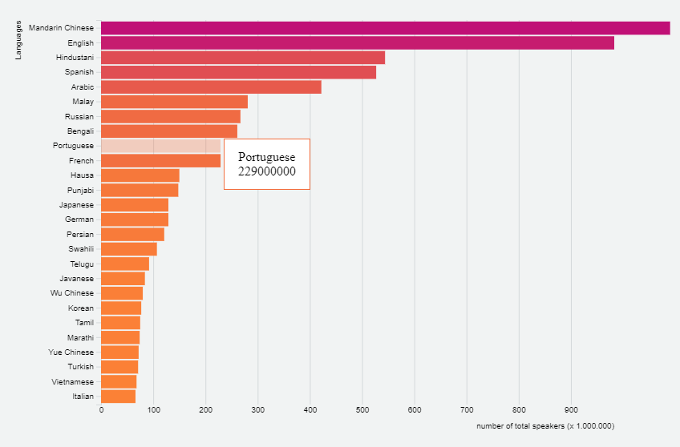

# Bar chart

A bar chart visualising the spoken languages and the number of speakers based on a [`bl.ock`][block] by **Alan Dunning** (MIT). 
<!-- Change link -->

## Background

For assessment 1 I wanted to create a bar chart that showed all the information needed for someone to be able to read it and make it a bit interactive with hovers effect. 
The bar chart is arranged by values order with on the y axis the languages spoken and on the x axis the numbers of speakers. Bij hovering on the bars a tooltip will appear with inside the name of the hovered language and the number of the speakers of it. On hovering the bar will also turn the opacity down to be clear to the user from which bar he is getting the information of it. 

## Data

Tab-separated values (TSV) with 26 rows and two columns:

* `language` — Name of language
* `speakers` — Estimated number of total speakers

The data from the TSV file has:
* 26 rows
* 2 columns
    * Name of languages 
    * Numbers of how many people speak the language
    
Languages listed was crawled from [wikipedia.org](https://en.wikipedia.org/wiki/List_of_languages_by_total_number_of_speakers).

## Features

* [`d3-scale`](https://github.com/d3/d3-scale#api-reference)
    — `d3.scaleLinear`
        Also known as a continuous scale because it maps a serial set of input values to output values. We can use that in a table to make the data grow to fit a specific range and domain. The range represents the values that we want to scale our data to.
    — `d3.scaleBand` 
        It maps a serial set of input values to output values. With a domain and a range, but also a couple of additional methods to control the spacing in between the bars. With the scale you can use the bandwidth method.
* [`d3-request`](https://github.com/d3/d3-request#api-reference)
    — `d3.tsv`
        Used for loading files
*   [`d3-axis`](https://github.com/d3/d3-axis#api-reference)
    — `d3.axisBottom` and `d3.axisLeft`
        Reference marks for scales
*   [`d3-selection`](https://github.com/d3/d3-selection#api-reference)
    — `d3.selectAll`
        used to get a selection of elements, and data() is bound to them. 
*   [`d3.mouse`](https://github.com/d3/d3-selection/blob/master/README.md#selection_on)
    — `mousemove`
        Mousemove event triggers every time the mouse pointer is moved over the div element.
    — `mouseover`
        Mouseover event triggers when the mouse pointer enters the div element.
     — `mouseout`
         Mouseout event occurs when the mouse pointer is moved out of the div element

## To do
- [ ] Sorting data A-Z / Z-A
- [ ] Add some animation

## The challenge
I really liked working with de d3js. I wished I had more time to try more features and make it more interactive. It was kind of hard to start with it in the beginning, because I didn't know if I started form scratch or took an already existing bar chart to use it as basis. Because of the short time to do this assessment I chose my second option and started to look for a base chart to start with. 

I found a lot of charts and tried to work with it and understand how d3js code works. I also took a [Lynda.com course](https://www.lynda.com/D3-js-tutorials/Learning-Data-Visualization-D3-js/594451-2.html), it helped me a lot to understand better the structure of the code. 

When I finally started coding I used ["Horizontal Bar Chart"](https://bl.ocks.org/alandunning/7008d0332cc28a826b37b3cf6e7bd998) as a base. I changed a couple of code to something that I understand better and added a few features to it. Like the color change, the text on the axis and the extra hover opacity effect.

## Links used for research

* [Github d3](https://github.com/d3/d3/)
* [Setting up the margins and the graph area.](http://www.d3noob.org/2012/12/setting-up-margins-and-graph-area.html)
* [Margin Convention](https://bl.ocks.org/mbostock/3019563)
* [Basic D3 Graphs](https://website.education.wisc.edu/~swu28/d3t/visualization.html)
*[Lynda: Learning Data Visualization with D3.js](https://www.lynda.com/D3-js-tutorials/Learning-Data-Visualization-D3-js/594451-2.html)

## License

[MIT](https://opensource.org/licenses/MIT) © Luisa Braga dos Santos

[block]: https://bl.ocks.org/alandunning/7008d0332cc28a826b37b3cf6e7bd998
